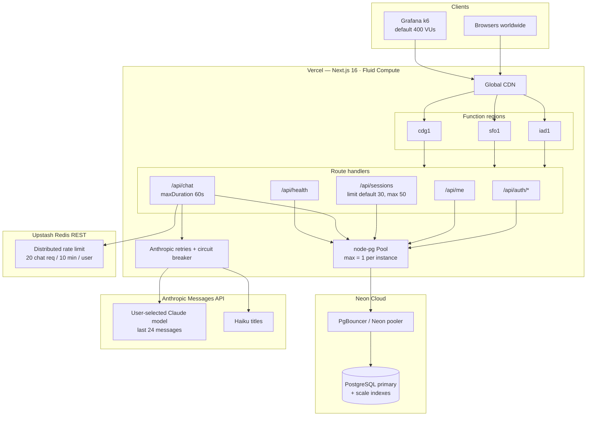
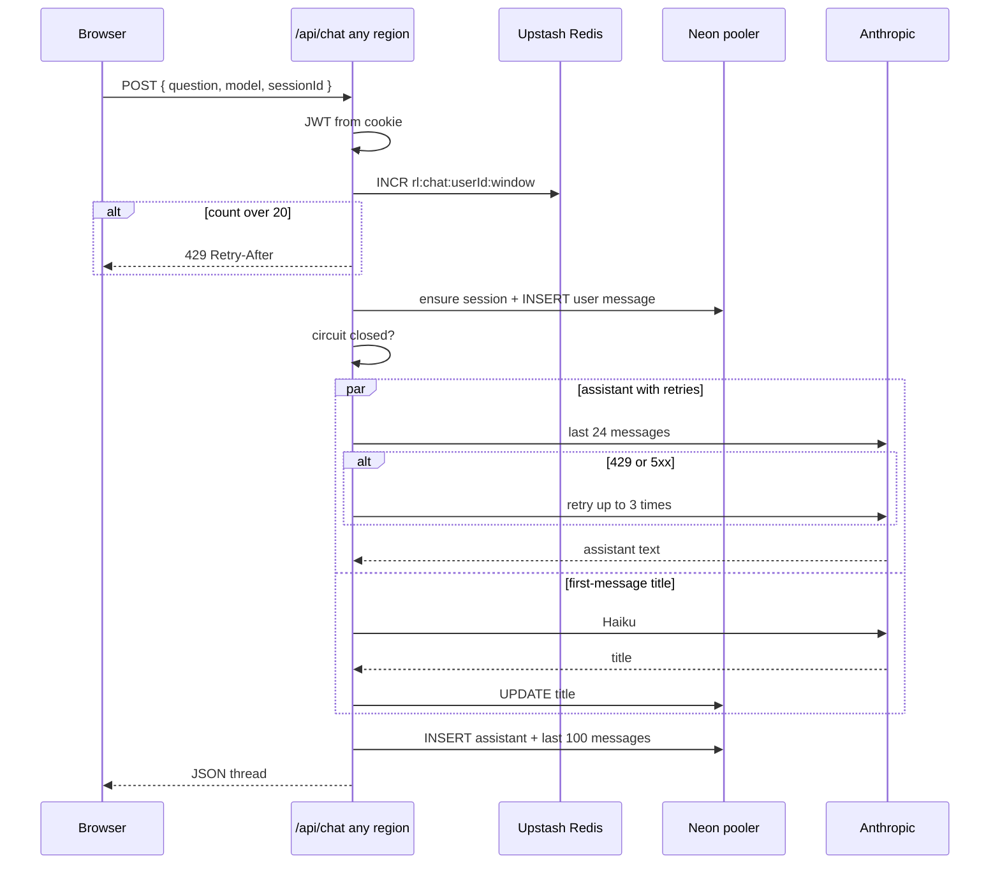

# System design — rag_chat_100k

**Role:** same product as `hundreds_app`, retuned so it can serve **tens of thousands of concurrent users** (on the order of ~100,000 daily active users).

**Intended load:** multi-region Vercel Functions, Neon accessed **only through a connection pooler**, distributed rate limits in Upstash Redis, tighter read/LLM budgets, and Anthropic retries with a circuit breaker.

**DAU** (Daily Active Users) is a product-capacity target: how many distinct people use the app in a day. It is not a load-test setting. This app is aimed at about **100,000 DAU**. Concurrent real users at peak are usually a small slice of that number.

**VU** (Virtual User) is a simulated client in the Grafana k6 load test. One VU repeatedly registers, logs in, and hits APIs. `K6_VUS=400` means 400 fake users at peak, not 400 real humans.

---

## Architecture



---

## What this system is

Still one Next.js app: profiles, JWT cookies, sessions and messages in Neon, Claude via the Messages API. Scale comes from **not multiplying scarce resources by the number of function instances**.

At tens of thousands of concurrent users, Vercel will run many Function instances across regions. Each instance that opened 25 Postgres connections (the hundreds-app default) would exhaust Neon. Each instance that kept its own rate-limit `Map` would let the same user burn Anthropic quota  N times. This design therefore:

1. Connects to Neon through a **pooler**, with **one** client connection per instance
2. Counts chat requests in **Upstash Redis** (REST), shared by every instance
3. Deploys Functions in **three regions** so users are not funneled through a single airport code
4. Caps how much data leaves Postgres and how much prompt is sent to Anthropic
5. Retries and trips a circuit breaker when Anthropic is 429/5xx, so a provider incident does not stampede the rest of the stack

### Client

Same SPA. Chat is still a single JSON round-trip. Session list responses send `Cache-Control: private, no-store` so intermediaries do not cache per-user lists.

On load, the browser calls **`GET /api/me`** (“who is the current user?”). That handler reads the JWT cookie, looks the user up in Postgres, and returns either `{ loggedIn: false }` or `{ loggedIn: true, userId, email }`. That is how the header knows you are signed in without putting the user id in `localStorage`.

### Vercel / Next.js

`vercel.json`:

```json
{
  "regions": ["iad1", "sfo1", "cdg1"],
  "functions": {
    "src/app/api/chat/route.ts": { "maxDuration": 60 }
  }
}
```

Fluid Compute still multiplexes concurrent invocations on warm instances (Active CPU billing while waiting on Anthropic). Multi-region means the **database and Redis must be reachable from all three**; the pooler URL and Upstash REST API are what make that safe.

**`maxDuration: 60` on `/api/chat`** is the maximum time Vercel will let that function run before it kills it: **60 seconds**. Chat waits for Anthropic, then writes to Postgres, which can take tens of seconds. Without this, the platform timeout could cut the request off mid-call. It is set twice: in `vercel.json` and as `export const maxDuration = 60` in the route. It is not a product rule that “the LLM must answer in 60s”; it is “Vercel may keep this invocation alive for up to 60s.”

**`GET /api/health`** is a liveness check for load tests and ops, not used by the chat UI. It runs `SELECT 1` against Postgres. If the DB is reachable it returns `{ ok: true, tier: "rag_chat_100k", dauTarget: 100000, redisConfigured }`. If not, it returns **503** with `{ ok: false, error }`. `redisConfigured` is true when the Upstash env vars are set.

**`GET /api/sessions`** pagination: if the client omits `limit`, return **30** sessions; the client can ask for more, but never more than **50**. `offset` pages further (`0`, then `30`, then `60`, …). That stops one request from loading thousands of old threads. (`hundreds_app` used default 50 / max 100; the baseline returned every session.)

### Upstash Redis

**Upstash Redis** is a hosted Redis (in-memory key/value store) that this app talks to over HTTPS. You do **not** deploy it on Vercel. You create a database in the Upstash cloud (or via the Vercel Marketplace), then set `UPSTASH_REDIS_REST_URL` and `UPSTASH_REDIS_REST_TOKEN`. The Next.js functions on Vercel call that URL. Redis lives in Upstash’s infrastructure; Vercel only stores the credentials.

In this project it is used for **rate-limit counters**, not for chat history. Chat history stays in Neon Postgres.

### Distributed rate limiting

`src/lib/rate-limit.ts`:

1. If `UPSTASH_REDIS_REST_URL` and `UPSTASH_REDIS_REST_TOKEN` are set, `INCR` + `EXPIRE` a window key via the Redis REST pipeline (for example `rl:chat:<userId>:<window>`)
2. Otherwise fall back to a larger in-process map (50,000 buckets) — local-dev only

**20 chat req / 10 min / user** means each signed-in user may call `/api/chat` at most **20 times in any 10-minute window**. After that the API returns **429** and a `Retry-After` header. That is stricter than `hundreds_app` (30 / 10 min). `AUTH_RATE_LIMIT` (10 / 15 min) is defined for the same helper but is not wired into the login/register routes in this codebase.

**Distributed** means the counter is shared. Vercel runs many function instances (and three regions here). An in-memory `Map` on one instance would only see traffic that landed on that instance, so the same user could send 20 requests × N instances. Redis is the component that makes the limit true **across instances and regions**. Without it, multi-region Fluid Compute would recreate the hundreds-app leak: one limiter per isolate.

### Neon + pooler

`DATABASE_URL` is documented as a **pooler** string (Neon pooler, Supabase transaction pooler, or PgBouncer), typically with `?pgbouncer=true`.

#### node-pg pool

`pg` is the Node Postgres driver. `Pool` (`src/lib/db.ts`) is a **small set of open TCP connections** reused across queries in that process, so every request does not open a new connection. On Vercel, each function instance has its own pool. This app defaults to **`PG_POOL_MAX=1`** because many instances would otherwise open too many connections to Neon.

| Setting | Default |
| --- | --- |
| `PG_POOL_MAX` | **1** |
| `PG_IDLE_TIMEOUT_MS` | 5_000 |
| `PG_CONNECTION_TIMEOUT_MS` | 3_000 |
| `allowExitOnIdle` | true |

The pool lives in the Next.js process. It is **not** Neon’s pooler.

#### PgBouncer and the Neon pooler

They are the **same job**, different packaging.

**PgBouncer** is a connection multiplexer: hundreds of app clients share a smaller number of real Postgres connections. Opening a Postgres connection is expensive, and Neon (like most Postgres) has a hard cap.

**Neon pooler** is Neon’s hosted PgBouncer. You get a different hostname in `DATABASE_URL` (often with `?pgbouncer=true`). The app still uses `pg.Pool`; that pool talks to the pooler, and the pooler talks to the database:

```
Vercel function  →  node-pg Pool (1 conn)  →  Neon pooler (PgBouncer)  →  Postgres
```

They are not two extra databases. The pooler is a door in front of the same Neon Postgres.

One connection per lambda × many lambdas is still a large number; the pooler multiplexes those onto a bounded set of connections to the primary. The app must not open a fat pool on the direct host.

#### Read budgets

- Sessions: default `limit=30`, max **50** (see `/api/sessions` above)
- Messages: last **100** rows (`ORDER BY sequence_no DESC LIMIT n`, then reversed)
- LLM context: last **24** messages

#### Scale indexes

**Scale indexes** are extra indexes in `pg_migrations/003_scale_indexes.sql`. They do not change the schema; they make hot queries cheaper at large row counts, on top of the indexes already in `001_chat_schema.sql`.

| Index | Speeds up |
| --- | --- |
| `users (LOWER(email))` | login by email |
| `chat_sessions (user_id, updated_at DESC) WHERE archived_at IS NULL` | sidebar session list |
| `chat_messages (session_id, created_at DESC)` | fetching the latest messages in a thread |

Message inserts still lock the session row (`FOR UPDATE`). That remains a per-thread hotspot: many users chatting in **different** sessions scale; many writers in the **same** session still serialize. At this product’s traffic shape (one user per thread), that is acceptable.

### OpenAI resilience

Retries and the circuit breaker live only in **`src/lib/openai.ts`**. `hundreds_app` calls Anthropic once and fails. `/api/chat` just calls `requestAssistantReply()`; the retry/breaker logic is inside `createMessage()`.

- **Retries:** up to **3** HTTP attempts. If OpenAI returns **429** or **5xx**, wait (`250 × 2^attempt` ms) and try again.
- **Circuit breaker:** after **5** failures on that function instance, refuse new OpenAI calls for **30 seconds**, then allow them again. State is in memory (`circuitFailures`, `circuitOpenUntil`), so each Vercel instance has its own breaker. It is not stored in Redis.

The breaker still sheds load when OpenAI is down (each instance stops piling retries after a handful of failures). A fully global breaker would need Redis; this version does not put breaker state there.

Context window: **24** messages (down from 40) to cut tokens and latency at high QPS.

### Load testing

k6 default peak is **400 VUs** (virtual users — simulated clients, not real DAU). Longer ramp, looser thresholds (failed < 8%, p95 < 12s) because some 429s under overload are expected. Runs are meant against a deployed URL that has the pooler and Redis, not localhost.

---

## Chat request flow



---

## Differences from hundreds_app

Same product, same Anthropic integration, same JWT cookie. The jump from “hundreds concurrent” to “tens of thousands concurrent” is almost entirely **shared infrastructure and tighter budgets**, because serverless concurrency multiplies whatever you put inside the isolate.

### 1. Postgres: fat pool → pooler + 1 connection

| | hundreds_app | rag_chat_100k |
| --- | --- | --- |
| `PG_POOL_MAX` | 25 | 1 |
| Target URL | Direct Neon is OK | **Pooler required** |
| Idle / connect timeouts | 10s / 5s | 5s / 3s |

Why: Function instance count grows with traffic. `25 × instances` connections will hit Neon’s cap long before CPU does. A pooler in front of the primary, plus a single client connection per isolate, is the standard serverless pattern at this scale.

### 2. Rate limits: in-memory Map → Upstash Redis

| | hundreds_app | rag_chat_100k |
| --- | --- | --- |
| Store | Process `Map` | Redis REST `INCR`/`EXPIRE`, local fallback |
| Chat budget | 30 / 10 min | **20 / 10 min** |
| Scope | One Function instance | All instances and regions |

Why: Fluid Compute + three regions means many isolates. A local limiter under-counts. Redis is the shared counter. The stricter 20/10 min budget also reduces Anthropic and DB write amplification when many users are active at once.

### 3. Multi-region compute

| | hundreds_app | rag_chat_100k |
| --- | --- | --- |
| Regions | `iad1` only | `iad1`, `sfo1`, `cdg1` |

Why: tens of thousands of concurrent users are not all next to Virginia. Pinning one region made sense when the bottleneck was a modest pool talking to one Neon primary. At this tier, CDN + three Function regions cut latency; the pooler and Redis REST APIs are region-agnostic enough to sit behind that.

Single-region was also a way to keep `pg` connection counts predictable. Multi-region is only safe **after** the pooler change.

### 4. Tighter read and prompt envelopes

| | hundreds_app | rag_chat_100k |
| --- | --- | --- |
| Session list | default 50, max 100 | default 30, max 50 |
| Message fetch | entire thread | last **100** rows |
| Anthropic context | 40 messages | **24** messages |
| Session response cache | none | `private, no-store` |

Why: payload size and prompt tokens dominate cost and tail latency when many chats are long. Returning and scoring less data is the cheapest horizontal scale lever that does not change the product.

### 5. Extra indexes

`003_scale_indexes.sql` is new (see **Scale indexes** above). Login by email, active-session lists, and newest-message fetches are the hot paths at 100k DAU. The hundreds app reused the baseline indexes only.

### 6. OpenAI retries and circuit breaker

hundreds_app failed the chat turn on the first Anthropic error. This app’s logic in `src/lib/openai.ts` retries 429/5xx (3 attempts, exponential backoff) and opens a per-instance circuit after 5 failures for 30 seconds.

Why: at high QPS, a brief OpenAI outage otherwise becomes a **retry storm** from every concurrent chat, which then knocks the pooler and Redis as well. Shedding work on the LLM path is part of staying up.

Caveat: circuit state is not in Redis, so each instance learns independently. That is weaker than a global breaker but still stops unbounded retry loops inside one isolate.

### 7. Load-test envelope

| | hundreds_app | rag_chat_100k |
| --- | --- | --- |
| Default peak VUs | 80 | **400** |
| p95 threshold | 8s | 12s |
| Failure rate | &lt; 5% | &lt; 8% (429s expected) |

The test is a design artifact: this tier is allowed to refuse work (429) rather than melt Neon or Anthropic.

### What did not change

- Still a single Next.js deployment (no separate worker, queue, or read replica in code)
- Still non-streaming JSON chat
- Still session-row `FOR UPDATE` on insert
- Still bcrypt + JWT cookies (CPU-heavy hashing; acceptable because auth QPS is far below chat QPS)
- `AUTH_RATE_LIMIT` is defined but not applied on `/api/auth/*`
- No cache of session lists or messages (Redis is used for limits, not data)

Those remaining single-primary and non-streaming choices are the next ceiling if concurrent users grow past this tier (read replicas, streaming tokens, a durable queue for titles, a global circuit breaker). They are out of scope for this version.
