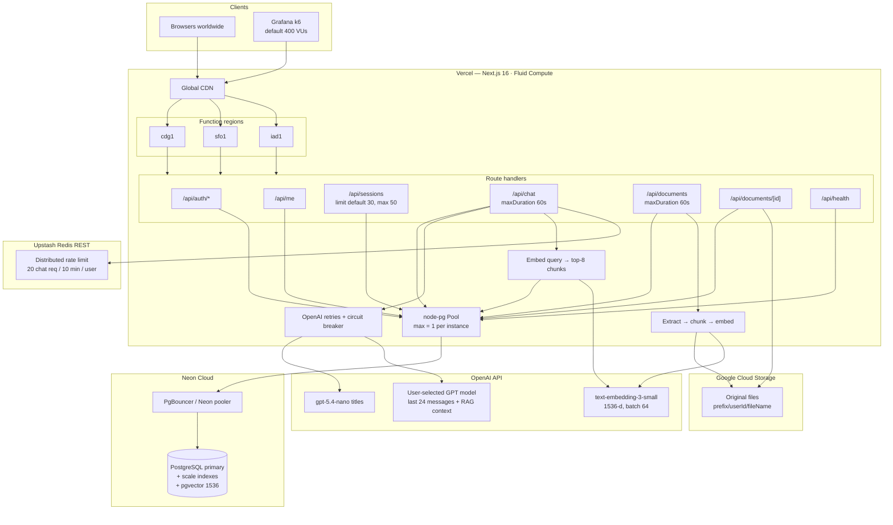
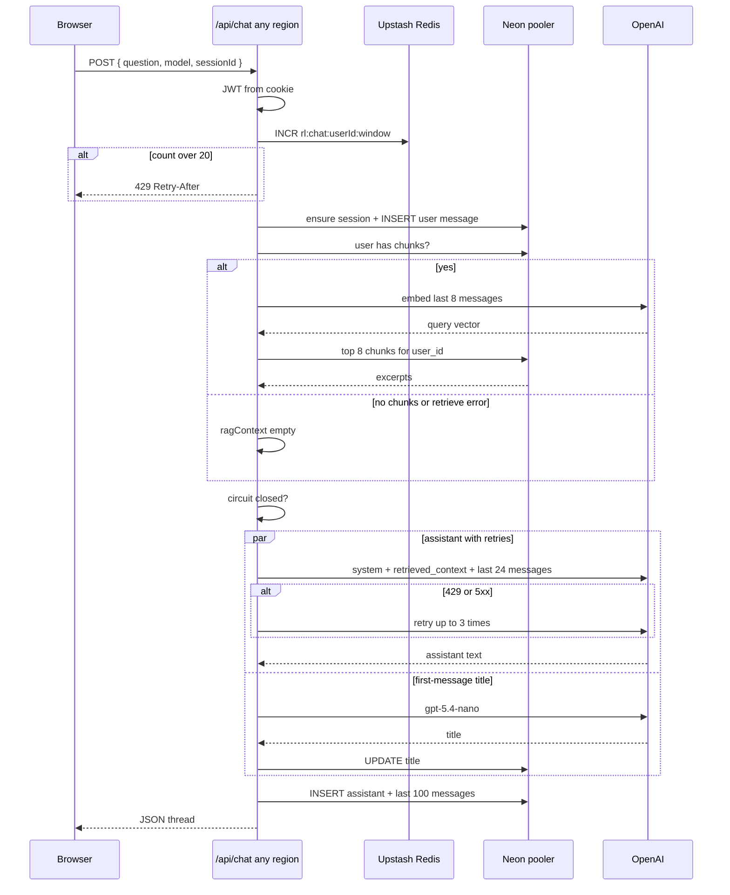
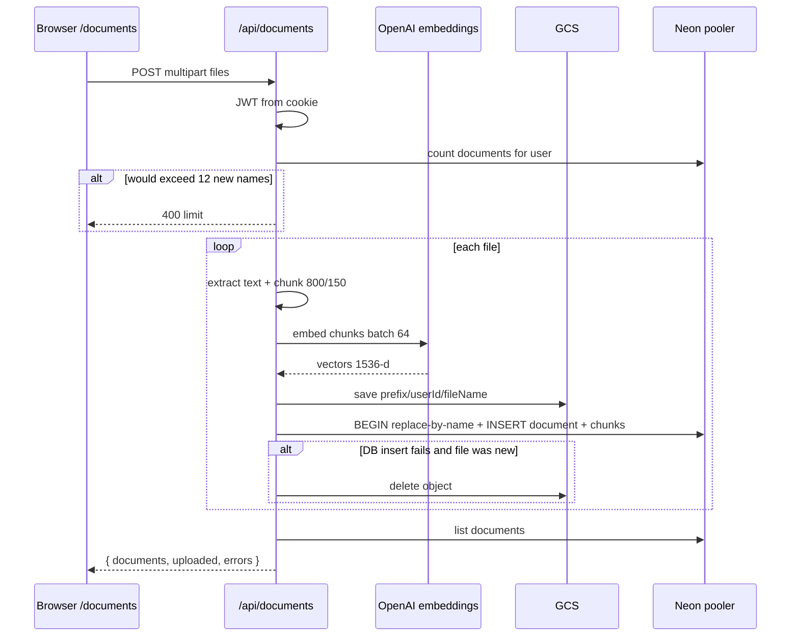

# System design — rag_chat_100k (RAG)

**Role:** same 100k-DAU chat product as `System_design_3.md`, plus **per-user document RAG**: upload files, store originals in GCS, index chunks with pgvector, and inject retrieved excerpts into the chat LLM prompt.

**Intended load:** unchanged from v3 — multi-region Vercel Functions, Neon **only through a connection pooler**, distributed rate limits in Upstash Redis, tighter read/LLM budgets, OpenAI retries with a circuit breaker. RAG adds embedding calls and vector search on the chat path, and a separate ingest path that writes object storage + Postgres.

**DAU** (Daily Active Users) is a product-capacity target: how many distinct people use the app in a day. It is not a load-test setting. This app is aimed at about **100,000 DAU**. Concurrent real users at peak are usually a small slice of that number.

**VU** (Virtual User) is a simulated client in the Grafana k6 load test. One VU repeatedly registers, logs in, and hits APIs. `K6_VUS=400` means 400 fake users at peak, not 400 real humans.

---

## Architecture



---

## What this system is

Still one Next.js app: profiles, JWT cookies, sessions and messages in Neon, chat via OpenAI. Scale still comes from **not multiplying scarce resources by the number of function instances**.

What is new is a **retrieval-augmented** chat path:

1. The user uploads documents on `/documents`
2. The server extracts text, chunks it, embeds the chunks, stores the **file** in GCS and the **chunks + embeddings** in Postgres
3. On each chat turn, if that user has chunks, the server embeds a short history query, finds the nearest chunks (cosine / pgvector), and appends them to the system prompt

At tens of thousands of concurrent users, Vercel will run many Function instances across regions. Each instance that opened 25 Postgres connections (the hundreds-app default) would exhaust Neon. Each instance that kept its own rate-limit `Map` would let the same user burn OpenAI quota N times. This design therefore:

1. Connects to Neon through a **pooler**, with **one** client connection per instance
2. Counts chat requests in **Upstash Redis** (REST), shared by every instance
3. Deploys Functions in **three regions** so users are not funneled through a single airport code
4. Caps how much data leaves Postgres and how much prompt is sent to OpenAI
5. Retries and trips a circuit breaker when OpenAI is 429/5xx, so a provider incident does not stampede the rest of the stack
6. **Scopes vector search to `user_id`**, so one tenant’s documents never enter another tenant’s prompt
7. **Fails RAG open**: if retrieval throws, chat still answers without context rather than failing the turn

### Client

SPA with two signed-in surfaces: **Chat** (`/`) and **Documents** (`/documents`). Chat is still a single JSON round-trip. Session and document list responses send `Cache-Control: private, no-store` so intermediaries do not cache per-user lists.

On load, the browser calls **`GET /api/me`**. That handler reads the JWT cookie, looks the user up in Postgres, and returns either `{ loggedIn: false }` or `{ loggedIn: true, userId, email }`. Unauthenticated visitors to `/documents` are sent back to `/`.

### Vercel / Next.js

`vercel.json`:

```json
{
  "regions": ["iad1", "sfo1", "cdg1"],
  "functions": {
    "src/app/api/chat/route.ts": { "maxDuration": 60 },
    "src/app/api/documents/route.ts": { "maxDuration": 60 }
  }
}
```

Fluid Compute still multiplexes concurrent invocations on warm instances (Active CPU billing while waiting on OpenAI or GCS). Multi-region means the **database, Redis, and GCS must be reachable from all three**.

**`maxDuration: 60`** is the maximum time Vercel will let that function run before it kills it. Chat waits for retrieval + OpenAI, then writes to Postgres. Ingest waits for text extraction, embedding batches, GCS upload, and a transactional insert. Without this, the platform timeout could cut the request off mid-call. It is set in `vercel.json` and as `export const maxDuration = 60` on those routes. It is not a product rule that “the LLM must answer in 60s”; it is “Vercel may keep this invocation alive for up to 60s.”

| Route | Role |
| --- | --- |
| `GET /api/me` | Current user from JWT cookie |
| `POST /api/auth/*` | Register / login / logout |
| `GET/POST/DELETE /api/sessions` | Chat session list and thread |
| `POST /api/chat` | RAG retrieve + assistant reply |
| `GET /api/documents` | List the user’s indexed files |
| `POST /api/documents` | Multipart ingest (extract, embed, store) |
| `DELETE /api/documents/[id]` | Delete GCS object + DB rows |
| `GET /api/health` | Liveness: `SELECT 1`, Redis configured flag |

**`GET /api/health`** is for load tests and ops, not the chat UI. If the DB is reachable it returns `{ ok: true, tier: "rag_chat_100k", dauTarget: 100000, redisConfigured }`. If not, **503**.

**`GET /api/sessions`** pagination: default **30** sessions, max **50**. `offset` pages further. That stops one request from loading thousands of old threads.

### Upstash Redis

**Upstash Redis** is a hosted Redis that this app talks to over HTTPS. It is used for **rate-limit counters**, not for chat history or embeddings. Chat history and vectors stay in Neon Postgres. Original files stay in GCS.

If `UPSTASH_REDIS_REST_URL` and `UPSTASH_REDIS_REST_TOKEN` are set, `INCR` + `EXPIRE` a window key (for example `rl:chat:<userId>:<window>`). Otherwise fall back to an in-process map — local-dev only.

**20 chat req / 10 min / user:** each signed-in user may call `/api/chat` at most **20 times in any 10-minute window**. After that the API returns **429** and `Retry-After`. Ingest is **not** on this limiter today; the per-user document cap (12 files, 10 MB each) is the ingest budget.

**Distributed** means the counter is shared across instances and regions. An in-memory `Map` would only see traffic that landed on that isolate.

### Neon + pooler

`DATABASE_URL` is a **pooler** string (Neon pooler, Supabase transaction pooler, or PgBouncer), typically with `?pgbouncer=true`.

```
Vercel function  →  node-pg Pool (1 conn)  →  Neon pooler (PgBouncer)  →  Postgres
```

| Setting | Default |
| --- | --- |
| `PG_POOL_MAX` | **1** |
| `PG_IDLE_TIMEOUT_MS` | 5_000 |
| `PG_CONNECTION_TIMEOUT_MS` | 3_000 |
| `allowExitOnIdle` | true |

#### Read and write budgets

- Sessions: default `limit=30`, max **50**
- Messages: last **100** rows
- LLM context: last **24** messages
- RAG query text: last **8** messages, max **6,000** characters
- RAG hits: **8** nearest chunks, formatted to max **8,000** characters
- Documents: max **12** per user; **10 MB** per file; **200** chunks per file
- Chunk inserts: batches of **25** rows per statement

#### Scale indexes (chat)

From `pg_migrations/003_scale_indexes.sql`:

| Index | Speeds up |
| --- | --- |
| `users (LOWER(email))` | login by email |
| `chat_sessions (user_id, updated_at DESC) WHERE archived_at IS NULL` | sidebar session list |
| `chat_messages (session_id, created_at DESC)` | fetching the latest messages in a thread |

Message inserts still lock the session row (`FOR UPDATE`). Many users in **different** sessions scale; many writers in the **same** session still serialize.

#### Document + vector schema

From `pg_migrations/004_document_embeddings.sql`:

- Extension **`vector`**
- **`documents`**: metadata + `gcs_path`, unique `(user_id, file_name)` so a re-upload of the same name replaces the previous file
- **`document_chunks`**: `content` + `embedding vector(1536)`, unique `(document_id, chunk_index)`, `ON DELETE CASCADE` from the parent document
- **HNSW** index on `embedding` with `vector_cosine_ops` (`<=>` distance in queries)
- B-tree on `documents (user_id, created_at DESC)` and `document_chunks (user_id)` so list and “does this user have any chunks?” stay cheap

Similarity returned to the app is `1 - (embedding <=> query)`, cosine similarity in \[-1, 1\]. Search SQL always includes `WHERE c.user_id = $userId`.

### Google Cloud Storage

GCS holds the **canonical file bytes**. Postgres holds searchable text and vectors, not the PDF/HTML blob.

- `GCP_BUCKET_PATH` = `bucket` or `bucket/optional-prefix` (default prefix `uploads`)
- Object key: `{prefix}/{userId}/{fileName}`
- Auth: `GOOGLE_APPLICATION_CREDENTIALS` (key file) or `GCP_SERVICE_ACCOUNT_JSON`
- Upload is non-resumable (`resumable: false`) — files are capped at 10 MB
- Delete is `ignoreNotFound: true` so a missing object does not block DB cleanup
- If the DB insert fails on a **new** file, ingest tries to delete the GCS object so the two stores do not drift

Chat never reads GCS. Retrieval uses only `document_chunks.content` and `documents.file_name`.

### RAG ingest

`POST /api/documents` (`src/lib/documents.ts`):

1. Require a signed-in user
2. Reject if the upload would exceed **12** documents (same file name counts as a replace, not a new slot)
3. Per file: size &gt; 0 and ≤ 10 MB; type in PDF, Markdown, TXT, CSV, JSON, HTML
4. Extract text (`unpdf` for PDF, UTF-8 / HTML strip / pretty JSON otherwise)
5. Chunk: **800** characters, **150** overlap, paragraph/sentence breaks, max **200** chunks
6. Embed with `text-embedding-3-small` in batches of **64**
7. Write the original bytes to GCS
8. In a transaction: if the same `(user_id, file_name)` exists, delete the old row (chunks cascade), insert the new document and chunk rows

Partial batch success is allowed: the response lists `uploaded` names and per-file `errors`.

### RAG retrieve (chat)

`POST /api/chat` calls `retrieveRelevantChunks` (`src/lib/rag.ts`) **after** the user message is stored and **before** `requestAssistantReply`:

1. If the user has no chunks, skip (no embedding call)
2. Build a query from the last 8 `role: content` lines, truncated to 6,000 characters
3. Embed that query
4. `ORDER BY embedding <=> query LIMIT 8` for that `user_id`
5. Format `[n] Source: fileName` blocks until **8,000** characters
6. If any step throws, use empty context and continue the chat

The system prompt is `OPENAI_SYSTEM_PROMPT` or `"You are a helpful assistant. Answer concisely and clearly."` When context is non-empty, the route appends:

```
Use the retrieved document excerpts below when they help answer the user. If they are irrelevant, ignore them and answer normally. Do not mention the retrieval process unless asked.

<retrieved_context>
...
</retrieved_context>
```

That string is a **system** message. The conversation (capped at 24 messages) follows it. Retrieved text is **not** stored as a chat message.

### OpenAI resilience

Retries and the circuit breaker live in **`src/lib/openai.ts`**, on **chat completions**. Embeddings retry 429/5xx up to 3 times with the same backoff but do **not** use the circuit breaker.

- **Retries (chat):** up to **3** HTTP attempts on **429** or **5xx**, wait `250 × 2^attempt` ms
- **Circuit breaker (chat):** after **5** failures on that function instance, refuse new **chat** calls for **30 seconds**. State is in memory per isolate, not Redis
- Chat models: `gpt-5.4`, `gpt-5.4-mini`, `gpt-5.4-nano` (user-selected); titles use `gpt-5.4-nano`
- Embeddings: `text-embedding-3-small`, **1536** dimensions
- Context window: **24** messages

### Load testing

k6 default peak is **400 VUs**. Longer ramp, looser thresholds (failed &lt; 8%, p95 &lt; 12s) because some 429s under overload are expected. Runs are meant against a deployed URL that has the pooler, Redis, and GCS, not localhost. The current k6 script does not exercise document ingest.

---

## Chat request flow



---

## Document ingest flow



Delete is the reverse: `DELETE /api/documents/[id]` removes the GCS object, then the `documents` row (chunks cascade).

---

## Differences from System_design_3

Same 100k-DAU envelope (pooler, Redis limits, multi-region, 24-message context, OpenAI retries). v4 adds the RAG product path.

### 1. Document ingest API and UI

| | v3 | v4 |
| --- | --- | --- |
| Surfaces | Chat only | Chat + `/documents` |
| Upload | none | `POST /api/documents`, 60s maxDuration |
| Cap | — | 12 files / user, 10 MB / file |

### 2. Object storage (GCS)

Originals live in GCS, keyed by user. Chat does not stream files to the model; only retrieved chunk text is added to the prompt.

### 3. pgvector index

`004_document_embeddings.sql` adds `vector`, `documents`, `document_chunks`, and an HNSW cosine index. ANN search is per `user_id`, top **8**, prompt budget **8,000** characters.

### 4. Extra OpenAI traffic

Each ingest file costs embedding tokens (chunk count, batched 64). Each chat turn with an indexed corpus costs **one extra embedding** for the query, then the usual chat completion (now with a larger system message). Users with no documents skip that embedding.

### 5. Failure policy on retrieve

v3 chat failed the turn if OpenAI chat failed. v4 still does that for the assistant call, but **retrieval errors are swallowed** so a vector/GCS blip does not take down chat.

### What did not change

- Still a single Next.js deployment (no separate worker, queue, or read replica in code)
- Still non-streaming JSON chat
- Still session-row `FOR UPDATE` on insert
- Still bcrypt + JWT cookies
- Redis is still limits-only (not a vector cache or document store)
- `AUTH_RATE_LIMIT` is defined but not applied on `/api/auth/*`
- Ingest is not Redis-rate-limited

Those remaining choices (sync ingest in the request, HNSW on the primary, no embedding cache) are the next ceiling if RAG QPS grows with chat QPS. They are out of scope for this version.
